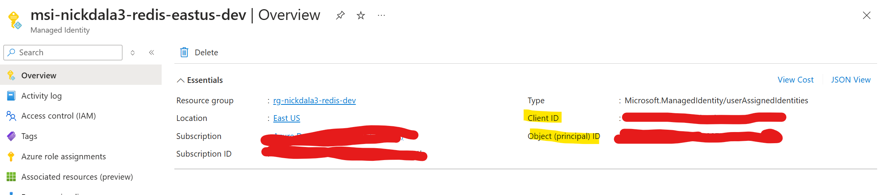
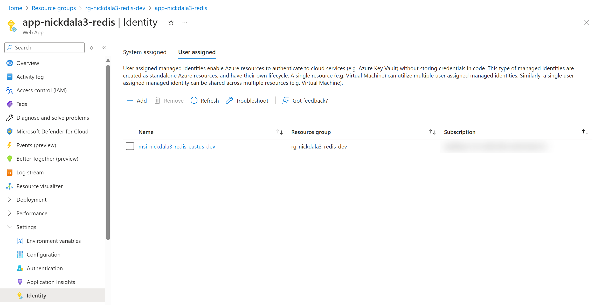
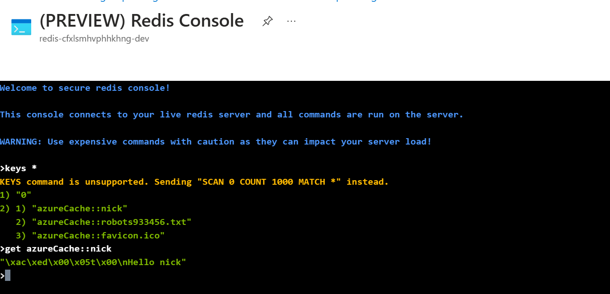

# Azure Cache for Redis with Microsoft Entra ID in a Spring Boot Application

This project demonstrates how to use [Azure Cache for Redis](https://learn.microsoft.com/en-us/azure/azure-cache-for-redis/cache-overview) with [Microsoft Entra ID](https://learn.microsoft.com/en-us/entra/fundamentals/whatis) in a Spring Boot application. The application is a simple REST API that stores and retrieves a name from a Redis cache. The application is deployed to [Azure App Service](https://learn.microsoft.com/en-us/azure/app-service/overview).

A managed identity is used to authenticate the application to Azure Cache for Redis. The managed identity is created and assigned the `Data Contributor` role. The application uses the managed identity to authenticate to Azure Cache for Redis.



The Client ID and the Object (principal) ID of the managed identity are used to configure the application to authenticate to Azure Cache for Redis.



The pom.xml file includes the following dependencies:

```xml
<dependency>
	<groupId>com.azure.spring</groupId>
	<artifactId>spring-cloud-azure-starter-data-redis-lettuce</artifactId>
</dependency>
<dependency>
	<groupId>org.springframework.boot</groupId>
	<artifactId>spring-boot-starter-data-redis<artifactId>
</dependency>
```

The application.yaml file includes the following configuration:

```yaml
spring:
  application:
    name: redis-passwordless
  data:
    redis:
      host: ${AZURE_CACHE_REDIS_HOST}
      port: 6380
      ssl:
        enabled: true
      azure:
        passwordless-enabled: true
        credential:
          client-id: ${AZURE_CACHE_REDIS_CLIENT_ID}
```

The **AZURE_CACHE_REDIS_USERNAME** is set to the Object ID of the managed identity. The **AZURE_CACHE_REDIS_CLIENT_ID** is set to the Client ID of the managed identity.

## Prerequisites

1. [Java 17](https://learn.microsoft.com//java/openjdk/download)
1. [Azure CLI](https://learn.microsoft.com/cli/azure/install-azure-cli-macos)
1. [Azure Dev CLI](https://learn.microsoft.com/azure/developer/azure-developer-cli/install-azd)
1. [Terraform](https://developer.hashicorp.com/terraform/downloads)

## Deploy

1. Log in to Azure
Before deploying, you must be authenticated to Azure and have the appropriate subscription selected. Run the following command to authenticate:

```
az login
```

Set the subscription to the one you want to use (you can use az account list to list available subscriptions):

```
export AZURE_SUBSCRIPTION_ID="<your-subscription-id>"
```

```
az account set --subscription $AZURE_SUBSCRIPTION_ID
```

Use the next command to login with the Azure Dev CLI (AZD) tool:

```
azd auth login
```

2. Create a new environment

Next we provide the AZD tool with variables that it uses to create the deployment. The first thing we initialize is the AZD environment with a name.

```
azd env new <pick_a_name>
```

Select the subscription that will be used for the deployment:

```
azd env set AZURE_SUBSCRIPTION_ID $AZURE_SUBSCRIPTION_ID
```

Set the Azure region to be used:

```
azd env set AZURE_LOCATION <pick_a_region>
```

3. Create the Azure resources and deploy the code

Run the following command to create the Azure resources and deploy the code (about 15-minutes to complete):

```
azd up
```

The deployment process will output the URL of the deployed application.

```
Deploying services (azd deploy)

  (✓) Done: Deploying service application
  - Endpoint: https://app-nick-redis.azurewebsites.net/


SUCCESS: Your application was deployed to Azure in 19 seconds.
```

## Test the application

The previous command will output the URL of the deployed application. You can use this URL to test the application.

```
curl <URL>/<name>
```

For example:

```
curl https://app-nick-redis.azurewebsites.net/nick
```

## Verify Azure Cache for Redis



## Clean up

```
azd down --purge --force
```

## Resources

- [Enable Microsoft Entra ID authentication on your cache](https://learn.microsoft.com/en-us/azure/azure-cache-for-redis/cache-azure-active-directory-for-authentication)
- [Spring Boot Azure Redis Sample](https://github.com/Azure-Samples/azure-spring-boot-samples/tree/main/cache/spring3-sample/spring-cloud-azure-redis-sample-passwordless)
- [Reliable Web App for Java](https://github.com/Azure/reliable-web-app-pattern-java)
